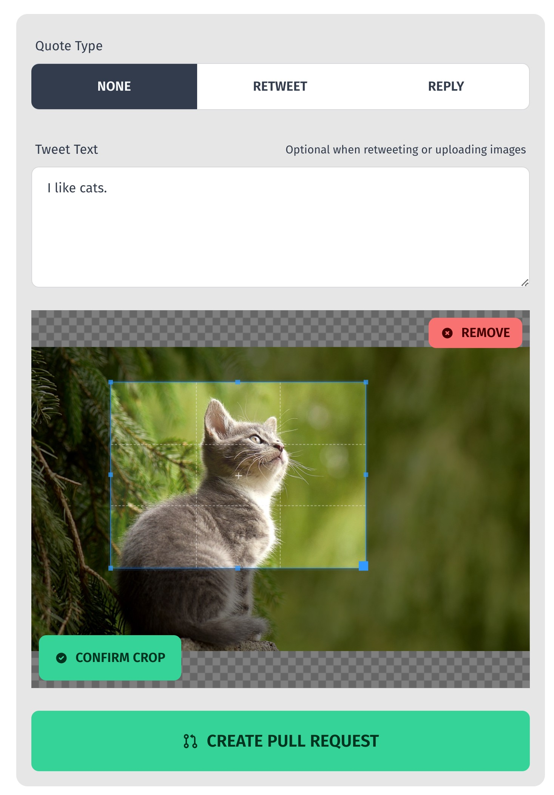

<div align="center">

# Contribunator

The GUI-assisted Pull Request Bot that says _hasta la vista_ 😎 to your GitHub contribution woes.



[](https://vercel.com?utm_source=contribunator&utm_campaign=oss)

</div>

## Demo

https://demo.contributions.app sumbits PRs to the [Sample Repo](https://github.com/Contribunator/Sample).

## About

Inspired by [Staticman](https://github.com/eduardoboucas/staticman), Contribunator is a web app that allows users to create GitHub Pull Requests for a repository without having to know how to use GitHub. While Staticman allows for the configuration of some basic pull request types, Contribunator is designed to provide more fine-grained control over contribution types, leveraging the full power of React/NextJS to deliver the best possible user experience and reduce friction.

A "contribution type" is a combination of a frontend form and a backend function that creates a pull request in the repository. These can be customized arbitrarily to suit the specific needs of your repository.

By default, the Contribunator Bot creates a new branch in the target repository and initiates a pull request against the `main` branch. If users are logged in with GitHub, the pull request will be created under their username. A single Contribunator deployment can support a single GitHub organization and multiple repositories, with each repository having multiple contribution types.

## Usage

In the future, a version of Contribunator may be available for public use with one-click installation and management via a config file in your repo (TODO).

For now, you need to create your own deployment:

1. Ensure that your target repositories are properly secured, e.g., with branch protection.
2. Fork this repository.
3. Update `contribunator.config.ts` with your repo-specific configuration.
4. [Create a Github App](#create-a-github-app), and install it on your organization.
5. Copy the relevant secrets into your [deployment environment](#authentication).
6. Deploy the app (e.g., using Vercel).

### Create a Github App

Contribunator Bot relies on the [creation and installation of a GitHub App](https://docs.github.com/en/apps/creating-github-apps/setting-up-a-github-app/creating-a-github-app) in the organization you wish to target.

- Ensure you [opt-out of token regeneration](https://docs.github.com/en/apps/creating-github-apps/authenticating-with-a-github-app/refreshing-user-access-tokens#configuring-your-app-to-use-user-access-tokens-that-expire).
- Enable read and write `Repository Permissions` for `Contents` and `Pull Requests`.
- Allow `Request user authorization (OAuth) during installation`.
- Install the app only for your target repositories.
- You may need to update the `Callback URL` in the app settings to match your deployment's URL.

### Authentication

Currently, Contribunator is hard-coded to require hCaptcha and GitHub authentication. In the future, more authentication methods will be supported, and the authentication methods will be configurable.

The following options are available for authentication:

- GitHub, via GitHub Apps
- hCaptcha
- API (TODO)
- No Auth (TODO, no captcha, not recommended)

You must configure environment variables for the authentication methods you wish to use.

```bash
# .env.local
NEXTAUTH_SECRET="xxx" # required in prod, generate with `openssl rand -hex 64`

# for github login
GITHUB_APP_CLIENT_ID="xxx"
GITHUB_APP_CLIENT_SECRET="xxx"

# for making PRs
GITHUB_APP_ID=123
GITHUB_APP_INSTALLATION_ID=123456
GITHUB_APP_PK="" # github-generated private key, replace new lines with \n (vercel does this automatically)

# for captcha
HCAPTCHA_SECRET="xxx"
NEXT_PUBLIC_HCAPTCHA_SITEKEY="xxx"
```

### Configuration

You should update `contribunator.config.ts` with your Organization, Repository, and Contribution types. Defaults are set in `app/config.ts`.

```js
// contribunator.config.ts
{
  // ...
  // Org Config
  title: "Contribunator Demo",
  description: "A tool to help you contribute to open source",
  owner: "Contribunator", // must match the orgnaization name
  // the following org config options are inherited by all repos, can be overridden in repo config
  branchPrefix: "c11r/",
  base: "main", // branch to create pull requests against (default is `main`)
  // Repo Config
  repos: {
    Sample: { // must match the name of the github repo
      title: "Sample Repo",
      description: "A demo repository",
      // Contributions Config
      contributions: [
        {
          type: "tweet", // must match an existing contribution type
          title: "Create a Tweet",
          color: "blue", // set to any tailwind color
          icon: FaTwitter, // imported from react-icons
          description:
            "Submit a twitter-together formatted tweet to the sample respository, demonstrating the use of Contribunator",
        },
      ],
    },
  }
}
```

You can also configure `tailwind.config.js` to use one of many [Daisy UI themes](https://daisyui.com/docs/themes/) or write a custom theme to customize the look and feel of your deployment.

You can also edit the React components directly in your fork to customize the UI.

### Deployment

Contribunator is a NextJS app and can be deployed to any platform that supports NextJS. The easiest way to deploy is with [Vercel](https://vercel.com/), which has a free tier.

Ensure your deployment has the correct environment variables, and configure the [Callback URL](#authentication) correctly for your deployment.

## Contribution Types

### Tweet

The `tweet` type is compatible with the [twitter-together](https://github.com/twitter-together/action) GitHub action.

### Roll your Own

You can implement your own contribution types by creating a new folder in the `app/contribute/[repo]/[your-name-here]` directory. More detailed documentation is to come, but for now, you can copy the structure of the other contribution types.

### Generic (TODO)

A basic contribution type, similar to Staticman, that allows users to create files in the repository. A predefined schema can be configured, and fields will be generated for the user to fill out.

You can compose a form using the following types:

- Input Text / Textarea
- Select (multiple-choice option)
- Image Upload

```js
// TODO: not implemented yet
form: {
  title: "My Form",
  fields: [{
    // todo
  }]
}
```

You can transform the submitted form into a JSON/YAML format, or perform an arbitrary transformation to a string, which will be submitted.

```js
// TODO: not implemented yet
transformation: {
  attach: 'append',
  fileName: "cats.json",
  fileName: (update) => `${update.title}.md`,
  format: 'json' | 'yaml',
  format: (update, existing) => `${JSON.stringify({...existing, ...update})}`,
}
```
